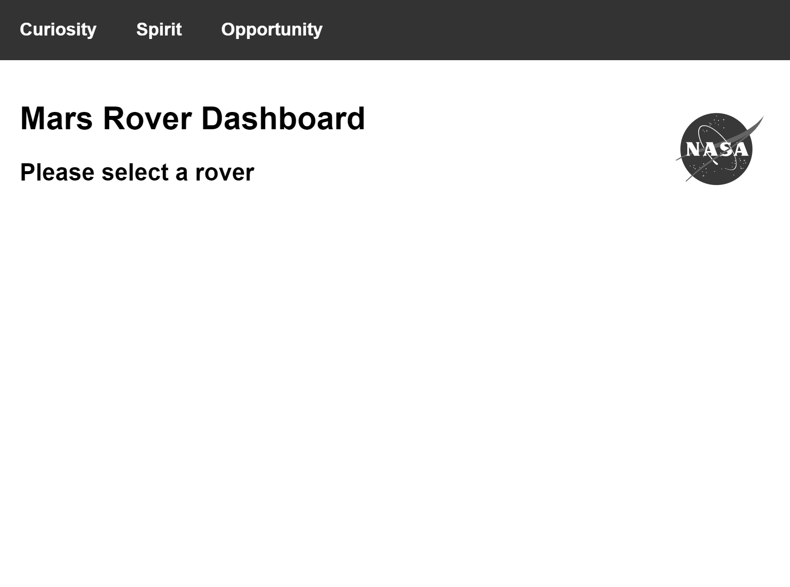

<p align="center">
  
</p>
<h1 align="center"> Mars Rover Dashboard </h1>
<p align="center">
  <b>An exercise in functional programming in JavaScript</b>
</p>

[![Github Actions][gh-actions-badge]][gh-actions-url]

## About the project
### Description
This is a simple dashboard-like application that consumes the [NASA Mars Rover Photos API](https://api.nasa.gov/).  
After selecting a rover, users can see some data about a rover and its mission and the most recent images it took.  
The main aim of this application was playing around with pure functions and functional concepts in JavaScript.

### Demo
There's an online demo deployed on Heroku: [functional-js-mars-rover.herokuapp.com](https://functional-js-mars-rover.herokuapp.com/).



### Build With
* [Express](https://expressjs.com/)
* [Immutable](https://immutable-js.github.io/immutable-js/)
* [Webpack](https://webpack.js.org/)
  
## Getting Started
### Prerequisites
- [Node.js](https://nodejs.org/en/) and npm installed
- a [NASA api key](https://api.nasa.gov/)
  
### Installation
1. Clone the repo
```bash
git clone https://github.com/laudep/functional-js-mars-rover.git
```
2. Install NPM packages (from the project's root folder)
```bash
npm install
```
3. Rename `.env-sample` to `.env`.  
   Replace the text 'YOUR_API_KEY' with your [NASA API KEY](https://api.nasa.gov/) and save the file.

4. Build and start the project
```bash
npm run build && npm start
```
5. Test the app: open http://localhost:3001/


[gh-actions-badge]: https://img.shields.io/github/workflow/status/laudep/functional-js-mars-rover/build-and-deploy
[gh-actions-url]: https://github.com/laudep/functional-js-mars-rover/actions
